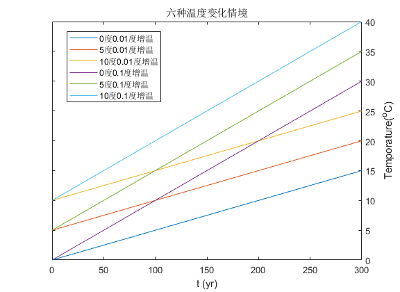

# 建模分析和代码说明

date: 2021-05-27

author:  Sid

## 一、要求

按照建立碳循环模型，然后探究三个地区在三种不同的温度变化（增温情境）下碳通量和碳储量的变化。

## 二、解题

解题过程分为3个部分：
* 建立模型
* 探究初始条件
* 使用Excel进行模拟
* 过程分析

### 2.1 建模
首先核心公式，NEP的变化

$$
NEP(t)= GPP(t)-Ra(t)-Rh(t) 
$$

其中每年呼吸作用(Ra+Rh)的计算公式是：

$$
Ra(t)+Rh(t)=C(t-1) \times K \times e^{aMAT(t)}  
$$

根据 $MAT=0$ 时周转时间为40年，可以得到
$$
K = \frac{1}{40}
$$

根据题目给出的$Q_{10}$，由PPT Page84页可得
$$
Q_{10}  =e^{10a}   =2
$$
可以得到参数$a=\frac{ln2}{10}$，所以可以对呼吸作用的公式进行化简得

$$
\begin{equation}
\begin{split}
Ra(t)+Rh(t) &=  C(t-1) \times K \times e^{\frac{\ln(2)}{10}MAT(t)}\\
&= C(t-1) \times K \times 2^{\frac{MAT(t)}{10}} \\
&= C(t-1) \times \frac{1}{40} \times 2^{\frac{MAT(t)}{10}}
\end{split} 
\end{equation}
$$

下文中无明确说明，将全部用**总呼吸作用（RES）代指Ra+Rh**。

最后我们看一下GPP，由PPT Page98可知
$$
GPP = GPP_{opt} \times T_{\varepsilon 2}
$$

其中已知$Gpp_{opt}=1018$, $T_{opt}=20$, 且

$$
T_{\varepsilon 2}(t)=\frac{1.1814}{(1+e^{0.2(T_{opt}-10-MAT(t))})(1+e^{0.3(-T_{opt}-10+MAT(t))})}  
$$

### 2.2 初始条件

这样所有的公式参数都知道了，再看初始条件

根据$t=0$时，$NEP=0$，可以知碳库C没有变化，再结合式$(1, 5, 6, 7)$可以得到不同地区的初始碳库大小。

对于温度为0的地区
$$
\begin{aligned}
GPP&=Ra+Rh\\
1018\times \frac{1.1814}{(1+e^{0.2(20-10-0)})(1+e^{0.3(-20-10+0)})}&= C(t=0) \times \frac{1}{40} \times e^{\frac{log2}{10}\times 0}
\end{aligned}
$$
据此可以计算出温度为年均温为0的地区初始碳库大小$C=5735.2$

如法炮制可以计算出各个地区的初始碳库大小。

### 2.3 进行模拟（代码说明）

#### 定义变量

GPP、NEP、RES、Csink、TEMP都是301*6的数组，第一行是初始状态，第2-301行是模拟的300年数据。6列分别对应6种情境。

|第1列|第2列|第3列|第4列|第5列|第6列|
|---|---|---|---|---|---|
|0度地区0.01度持续增温|5度地区0.01度持续增温|10度地区0.01度持续升温|0度地区1度持续升温|5度地区1度持续升温|10度地区1度持续升温|

#### Pre calculation

Part1：对初始状态进行计算

Part2：设置六种情境的温度变化（对应上表）

#### SImulation

从第2行开始逐行处理（对应是从第1年开始模拟到第300年）

模拟利用了MATLAB向量运算的特性，使用行向量作为中间变量传入函数，简化了代码（少用了一层循环）。

#### 保存数据

保存为了`.mat`格式

#### 自定义函数部分

GetGPP()：根据式6

GetT_eps2()：根据式7

GetRES()：根据式5

其中关于时间t，在调用函数的时候考虑了，如`t-1`对应了`year_index-1`

---

项目文件保存在我的[Github](https://github.com/sidpku/HW_GeneralEcology)上。

