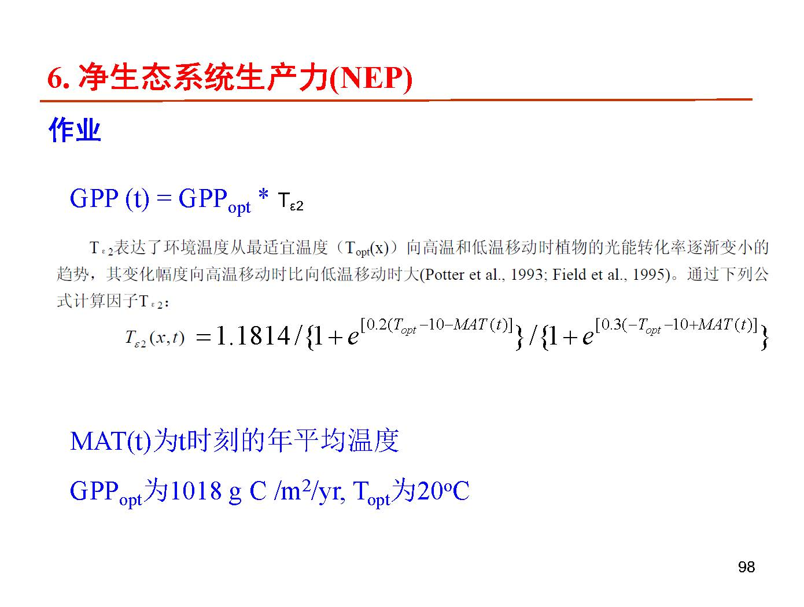
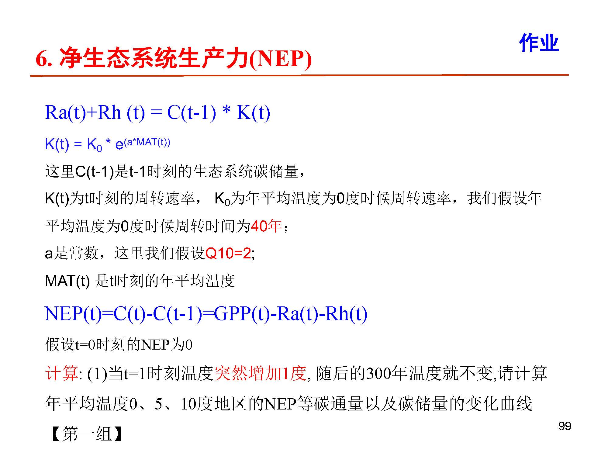
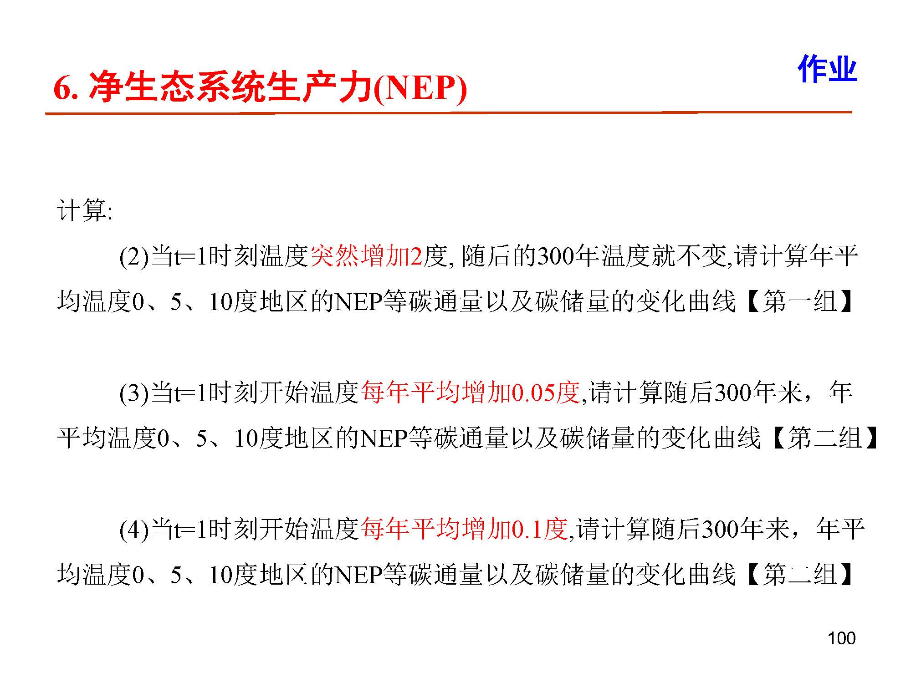

# 普通生态学3 第二次课程报告

Date: 2021-5-22

Author: Sid

## 简介

目前还在整理文件，这里是2020年上这次课的时候写的代码、数据和分析文件。

目前只需要用到main.m.

上次作业分到的是第三组，所以需要重设温度变化情境后，再进行模拟。main.m的代码可用，但需要改一改温度情境。

## 作业要求

完成课程作业中第二组的要求，第(3),(4)小题。

## 文件说明

首先按照题目进行模拟用的文件，也是这次作业可以再次利用的部分：

* main.m 是进行**数据模拟的程度代码**。
* homework-02-data包含了**基础数据**，是对温度变化情景的模拟。

其次是对模拟结果进行分析用的文件，这部分文件只当参考，跟完成这次作业关系不大。

* data_analysis.m是进行**数据分析的程序代码**。
* report_ver01.md 是2020年时候写的**分析报告**。
* homework-02-analysis整合了数据，是方便分析用的。
* calculation.md 是进行分析的时候进行的一部分演算。

对部分文件的说明：、

* homework-02-data
  * 情境2是我们的第1题（0.05度增温）
  * 情境3是我们的第2题（0.1度增温）
* homework-02-analysis
  * 分析2对应第1题
    * 2-1是0度地区
    * 2-2是5度地区
    * 2-3是10度地区
  * 分析3对应第2题
    * 3-1是0度地区
    * 3-2是5度地区
    * 3-3是10度地区
  

