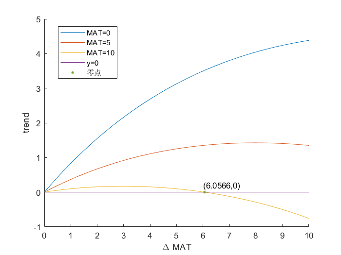
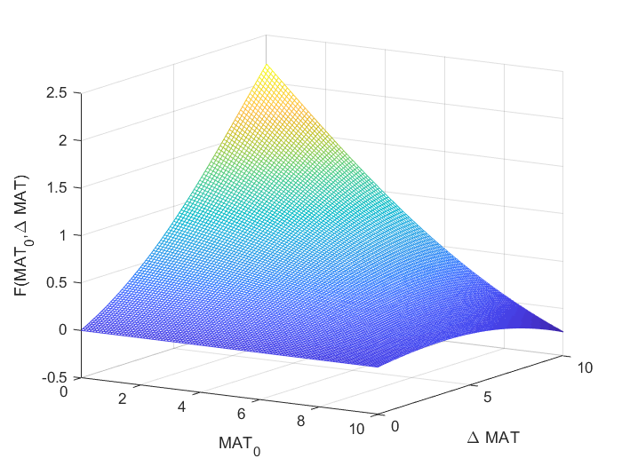
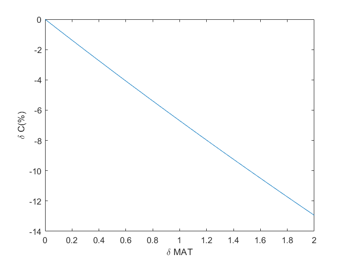

# Homework-02

date: 2020-04-21

author: 陈昱锜

## 目录

[TOC]

---

## 一、要求

按照建立碳循环模型，然后探究三个地区在三种不同的温度变化（增温情境）下碳通量和碳储量的变化。

## 二、解题

解题过程分为3个部分：
* 建立模型
* 探究初始条件
* 使用Excel进行模拟
* 过程分析

### 2.1 建模
首先核心公式，NEP的变化

$$
NEP(t)= GPP(t)-Ra(t)-Rh(t) \tag{1}
$$

其中每年呼吸作用(Ra+Rh)的计算公式是：

$$
Ra(t)+Rh(t)=C(t-1) \times K \times e^{aMAT(t)}  \tag{2}
$$

根据 $MAT=0$ 时周转时间为40年，可以得到

$$
K = \frac{1}{40}
$$

根据题目给出的$Q_{10}$，可以得到参数$a=\frac{ln2}{10}$

$$
Q_{10}  =e^{10a}   =2
$$

所以可以对呼吸作用的公式进行化简得
$$
Ra(t)+Rh(t) = C(t-1) \times K \times 2^{\frac{MAT(t)}{10}} \tag{3}
$$

下文中无明确说明，将全部用呼吸作用（RES）代指Ra+Rh。

最后我们看一下GPP
$$
GPP = GPP_{opt} \times T_{\varepsilon 2}    \tag{4}
$$

其中已知$Gpp_{opt}=1018$, $T_{opt}=20$, 且

$$
T_{\varepsilon 2}(t)=\frac{1.1814}{(1+e^{0.2(T_{opt}-10-MAT(t))})(1+e^{0.3(-T_{opt}-10+MAT(t))})}   \tag{5}
$$

### 2.2 初始条件

这样所有的公式参数都知道了，再看初始条件

根据$t=0$时，$NEP=0$，可以知碳库C没有变化，再结合式$(2)(4)(5)$可以得到不同地区的初始碳库大小。

对于温度为0的地区
$$
\begin{aligned}
GPP&=Ra+Rh\\
1018\times \frac{1.1814}{(1+e^{0.2(20-10-0)})(1+e^{0.3(-20-10+0)})}&= C(t=0) \times \frac{1}{40} \times e^{\frac{log2}{10}\times 0}
\end{aligned}
$$
据此可以计算出温度为年均温为0的地区初始碳库大小$C=5735.2$
如法炮制可以计算出各个地区的初始碳库大小

### 2.3 使用Excel进行模拟

根据$C(t)=C(t-1)+NEP(t)$，再结合2.1中得到的GPP、Ra+Rh、NEP计算公式，代入初始碳库大小C，就可以按照预设温度条件进行模拟了。

使用Excel模拟的过程数据放在文件 `homework-02-data.xlsx`中

> **Excel中工作表命名的说明：**
>
> 情境1对应1度增温情境（即第1问，所有组都要做的作业）
>
> 情境2对应1度增温后的0.05度递增温情境（即第5问，三组）
>
> 情境3对应1度增温后的0.1度增温情境（即第6问，三组）
>
> **Excel中图的说明：**
>
> 左轴是GPP、Ra+Rh、NEP的坐标轴，右轴是碳库大小的坐标轴，横轴为时间（年）
>
> 我单独将折线图另保存为了png文件，文件名格式为figureX-Y.png，X是情境序号，1/2/3对应情境1/2/3，Y是地区序号，1/2/3对应地区温度0/5/10。

### 2.4 过程分析

我将模拟得到的数据重新整合，放在文件 `homework-02-analysis.xlsx` 中，方便进行后续的分析。

> **关于工作表的命名：**
>
> | 工作表名 | 分析内容                                   |
> | -------- | ------------------------------------------ |
> | 分析1    | 0度地区在三个温度变化情境下的模拟结果比较  |
> | 分析2    | 5度地区在三个温度变化情境下的模拟结果比较  |
> | 分析3    | 10度地区在三个温度变化情境下的模拟结果比较 |
> | 分析4    | 情境1下三个地区的模拟结果比较              |
> | 分析5    | 情境2下三个地区的模拟结果比较              |
> | 分析6    | 情境3下三个地区的模拟结果比较[^1]          |
> **关于列的命名**
>
> 列名称由 `ABC X-Y`构成，ABC即变量名，如GPP/RES/NEP/Csink[^2]，X对应情境1/2/3，Y对应地区1/2/3.

#### 2.4.1 情境1中的空间异质性

- [x] 三个地区都是碳汇，且因为碳库大小不同，所以出现增加~~这部分是GPP公式弄错了。。。还好刘源提醒了。发现NEP的变化差异主要是由于呼吸作用的反应不同导致的。我认为是由于地区2/3的碳库大，所以导致温度上升后RES上升幅度大于GPP，使得地区2/3的Csink下降。~~:thumbsdown:
- [x] 温度越高的地区碳库的变化幅度越小。~~但通量（GPP/RES）的变化幅度却更小。两个变化幅度间的差异还是由于碳库大小导致的。GPP变化有相同的变化趋势，或许可以看一看变化幅度~~:thumbsdown:
- [ ] 呼吸作用与温度间的响应关系比较复杂，如何分析？
- [x] 温度突变会导致碳库如何变化？:thumbsup:
- [x] 初始碳库大小和温度是简单的相关关系吗？并不是:thumbsup:

* 分析了温度突变与碳库变化趋势之间的关系（只有方向，没有幅度）。高温度地区由于温度高，GPP更易饱和；碳库比较大，使得RES增幅明显。

* 初始温度和碳库大小的关系，如图：

经过探究发现，这个值最大为12538，初始温度约为12.97.这个值能被突破吗？我认为不能突破，与后面的三维图使用相同的公式进行判断。

* 进一步，探究初始温度和增温的关系：

增温后会不会导致碳库变化呢？在增温$\Delta MAT $和初始温度 $MAT(t_0)$之间能够建立关系。要维持碳库不变，需要$GPP \& RES $互相抵消，$GPP$和$MAT \& \Delta MAT$有关，$RES$ 除了和温度$MAT(t_0)+\Delta MAT$有关，还跟$C(t-1)$还有关，而即$C(t-1)\sim GPP\sim MAT(t_0)$ ，所以最终就是$\Delta MAT$ 和 $MAT(t_0)$ 的关系。

> 这个地方没有解出函数关系式（太难了不会），但是通过折中的办法看了一看两者的关系。

* 对于突然增温1度（情景1）

| 温度     | 碳库大小 | Q~10~ | RES  |
| -------- | -------- | ----- | ---- |
| :arrow_up: | 不变 | :arrow_up: | :arrow_up: |

碳库越大、温度上升越大，RES上升越大，且RES被温度控制的部分是指数型增长的。

* 对于持续均匀增温（情景2,3）

| 温度       | 碳库大小     | Q~10~      | RES                       |
| ---------- | ------------ | ---------- | ------------------------- |
| :arrow_up: | :arrow_up:   | :arrow_up: | :arrow_up:                |
| :arrow_up: | :arrow_down: | :arrow_up: | :arrow_up: / :arrow_down: |

~~我认为分析呼吸作用不变没有意义，是拿结果（Csink的变化）来看呼吸作用恒定，即便某一时刻满足了条件，接下来GPP随着升温增大也会打破平衡状态。所以下面的分析都删去了。~~

~~对于其中的第二种情况，什么时候呼吸作用会不变呢？我们按照呼吸作用公式来分析：~~
$$
Ra(t)+Rh(t) = C(t-1) \times K \times 2^{\frac{MAT(t)}{10}} \tag{3}
$$
~~其中，要使得碳库的变化能够抵消温度的影响，当碳库变化大于此临界值时，可以使得升温的促进作用消失。经分析得 $\delta C = C(t-1)\times [(\frac{1}{2})^{\frac{\delta MAT}{10}}-1]$ ,  $\delta C$ &  $\delta MAT$ 对 $RES$ 的影响可以看下图 (纵轴 $\delta C$(%)是对 $C(t-1)$ 的占比)。~~

~~以情景2为例分析：~~

~~时，$\delta C（\%）$ 计算得到 $-0.69\%$.~~

#### 2.4.2 情境2中的空间异质性

- [ ] 发现Csink在10度地区竟然在增温后降到了最低
- [ ] ~~GPP在三个地区的后期都达到了顶峰~~
- [x] 探究GPP随着温度的变化趋势，到底是怎样的？
- [ ] Csink的变化幅度并不是和初始碳库大小简单相关的，具体的相互关系是什么？

探究了GPP随温度的变化趋势，是先升高后下降的

#### 2.4.3 情景3 的空间异质性

- [ ] 发现温度越高的地区，碳库大小达到峰值的时间越早。
- [ ] 发现温度越高的地区，碳库减小的更快

#### 2.4.4 地区1的变化差异

- [x] ~~似乎最后都会趋近于平衡态(见2.4.5)，达到平衡态的时间可以代表什么特征？resilience?~~可能就不存在平衡态[^3]，如何进行数学证明？
- [ ] 碳库越大的地方，达到平衡前储量的变化越大，这个地方看变化的绝对值还是相对值？分别有什么意义？

#### 2.4.5 地区2的变化差异

- [ ] 如果将模拟的时间继续延长，会不会达到平衡态？即在温度不断变暖的情况下，依旧达到 $NEP=0$ 的情况。
- [ ] ~~我觉得分析变化幅度也需要按照达到平衡态来分析。300年尺度上模拟，觉得情景2的变化幅度最小，但平衡状态不一定吧。~~温度持续增加的情况下，平衡态不一定存在的，有可能直接趋于毁灭了[^3]。

#### 2.4.6 地区3的变化差异

- [x] 发现地区3的NEP一直为负。与地区2的比较后（相同的温度变化模式），我认为与该地区的碳库大，导致RES更强的结果。

## 三、总结

后续还有很多工作可以做

* 检验正确性：首先我不太确定K的求值方法是否正确，其次Excel的操作过程、公式的推导过程都有可能失误，希望能够有其他答案相互对照。
* 后续分析：有两个维度的比较可以进行，一个是同一温度变化条件下，三个地区的GPP、NEP变化，进行地区间的比较；另一个是同一地区不同温度变化条件下的比较，进行变暖条件之间的比较。
* 后续分析: 注意到NEP的峰值，或许可以探究此时温度与T~opt~的关系
* 后续比较的时候，一次比较可以只比较一个量，分析异同后结合其他通量、储量的变化进行归因。~~现在的9张图，将所有通量储量放在一起，看起来还是比较乱。~~ 可以在`homework-02-analysis.xlsx`中进行分析，看起来更清晰。需要关注的是**碳库大小Csink** 和 **生产力GPP** & **呼吸作用RES **这三个量，我觉得这三个量会比较关键。
* 数据误差：Excel和Matlab的运算结果稍有差异。我简单的用Matlab算了三个地区的初始碳储量，发现和Excel中的计算结果稍有差异的，可能的原因是计算精度不同。具体见表2.在Excel中进行模拟的时候，所有的数据都是从原始数据在Excel中计算得到的，没有使用Matlab中的计算结果。

表2: Matlab和Excel对初始碳库大小的计算差异

| 地区年均温 | Matlab结果 | Excel结果 |
| ---------- | ---------- | --------- |
| 0          | 5735.2     | 5733.74   |
| 5          | 12938      | 12937.50  |
| 10         | 23053      | 24053.16  |

[^1]: 情境1/2/3对应的温度变化情况可以看2.3中的说明。
[^2]: Csink是碳库大小。

[^3]: 见`homework-02-hypothsis.xlsx` 中的模拟，地区2情景2/3的模拟最后都趋于毁灭了。

